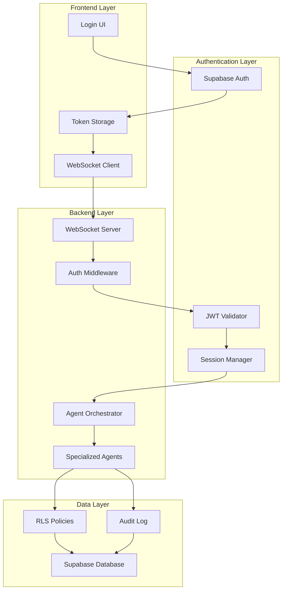
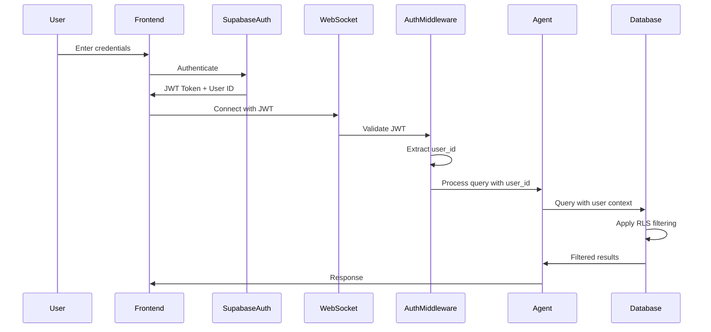

# Design Document

## Overview

The User Authentication system provides a comprehensive security layer for the Voice-Based Painting Business Agent, ensuring that painting contractors can only access their own business data. The system implements three core security mechanisms: session-based authentication using Supabase Auth with JWT tokens, database-level row-level security (RLS) policies for automatic data filtering, and comprehensive audit logging for all data modifications.

The authentication system integrates seamlessly with the existing multi-agent architecture, adding security context to every request without disrupting the voice and text interaction flows. All specialized agents (Contacts, Projects, Appointments, Proposals, Invoices, Reviews, Marketing, Tasks, Settings) automatically respect user boundaries through RLS policies enforced at the database level.

## Architecture

### High-Level Security Architecture



### Authentication Flow



### Data Isolation Architecture

The system implements defense-in-depth with multiple layers of security:

1. **Application Layer**: User context propagation through all agent calls
2. **Middleware Layer**: JWT validation and session management
3. **Database Layer**: RLS policies that cannot be bypassed
4. **Audit Layer**: Comprehensive logging of all data access and modifications

## Components and Interfaces

### Frontend Components

#### Authentication UI Component
- **Purpose**: Handles user login, logout, and session management
- **Integration**: Supabase Auth SDK for authentication
- **Responsibilities**:
  - User credential collection and validation
  - JWT token storage in secure browser storage
  - Automatic token refresh before expiration
  - Session state management across page reloads
  - Logout and session cleanup
- **Key Methods**:
  - `login(email, password)`: Authenticates user and stores JWT
  - `logout()`: Clears session and redirects to login
  - `refreshToken()`: Refreshes JWT before expiration
  - `getSession()`: Retrieves current session with user_id

#### Authenticated WebSocket Client
- **Purpose**: Manages WebSocket connections with authentication
- **Responsibilities**:
  - Include JWT token in connection headers
  - Attach user_id to all outgoing messages
  - Handle authentication errors (401, 403)
  - Automatic reconnection with token refresh
- **Key Methods**:
  - `connectWithAuth(jwt)`: Establishes authenticated connection
  - `sendAuthenticatedMessage(message, user_id)`: Sends message with user context
  - `handleAuthError()`: Handles token expiration and re-authentication

### Backend Components

#### Authentication Middleware
- **Purpose**: Validates JWT tokens and extracts user context
- **Location**: WebSocket server layer
- **Responsibilities**:
  - Validate JWT signature and expiration on connection
  - Extract user_id from JWT payload
  - Attach user_id to session context
  - Implement rate limiting per user
  - Handle token refresh requests
- **Security Features**:
  - Token expiration enforcement
  - Invalid token rejection
  - Brute force protection
  - Session timeout management
- **Key Methods**:
  - `validateJWT(token)`: Validates token and returns user_id
  - `extractUserContext(jwt)`: Extracts user_id and permissions
  - `enforceRateLimit(user_id)`: Applies per-user rate limits
  - `handleTokenExpiration()`: Manages expired tokens

#### User Context Propagator
- **Purpose**: Ensures user_id flows through all agent calls
- **Location**: Agent Orchestrator
- **Responsibilities**:
  - Accept user_id parameter in all query processing
  - Pass user_id to Supervisor Agent
  - Ensure all specialized agents receive user context
  - Validate user_id is present before processing
- **Key Methods**:
  - `processQueryWithUser(query, user_id)`: Main entry point with user context
  - `validateUserContext(user_id)`: Ensures valid user_id
  - `propagateToAgents(query, user_id)`: Passes context to agents

#### Audit Logger
- **Purpose**: Comprehensive logging of all data operations
- **Location**: Shared utility across all agents
- **Responsibilities**:
  - Log all database modifications with user_id
  - Log security violations and failed validations
  - Track cross-table relationship access
  - Encrypt sensitive data in logs
- **Log Format**:
  ```python
  {
    "user_id": "uuid",
    "timestamp": "ISO8601",
    "operation": "INSERT|UPDATE|DELETE|SELECT",
    "table": "table_name",
    "record_ids": ["uuid1", "uuid2"],
    "success": true|false,
    "error": "optional error message"
  }
  ```
- **Key Methods**:
  - `logModification(user_id, operation, table, records)`: Logs data changes
  - `logSecurityViolation(user_id, attempted_action, reason)`: Logs violations
  - `logRelationshipAccess(user_id, tables, records)`: Logs cross-table access

### Database Components

#### Row-Level Security (RLS) Policies
- **Purpose**: Database-level enforcement of data isolation
- **Implementation**: PostgreSQL RLS policies on all tables
- **Policy Structure**:
  ```sql
  -- Example for contacts table
  CREATE POLICY "Users can only access their own contacts"
    ON api.contacts
    FOR ALL
    USING (user_id = auth.uid());
  ```
- **Tables with RLS**:
  - api.contacts
  - api.projects
  - api.invoices
  - api.proposals
  - api.appointments
  - api.reviews
  - api.campaigns
  - api.conversations
  - api.tasks
  - api.goals
  - api.settings
- **Policy Types**:
  - SELECT: Filter results by user_id
  - INSERT: Automatically set user_id to auth.uid()
  - UPDATE: Only allow updates to user-owned records
  - DELETE: Only allow deletes of user-owned records

#### User ID Schema Changes
- **Purpose**: Add user_id column to all tables for RLS
- **Implementation**:
  ```sql
  -- Add user_id to existing tables
  ALTER TABLE api.{table_name}
    ADD COLUMN user_id UUID NOT NULL
    REFERENCES auth.users(id);
  
  -- Create index for performance
  CREATE INDEX idx_{table_name}_user_id
    ON api.{table_name}(user_id);
  ```
- **Required for Tables**: All tables in api schema

#### Audit Log Table
- **Purpose**: Store comprehensive audit trail
- **Schema**:
  ```sql
  CREATE TABLE api.audit_logs (
    id UUID PRIMARY KEY DEFAULT gen_random_uuid(),
    user_id UUID NOT NULL REFERENCES auth.users(id),
    timestamp TIMESTAMPTZ NOT NULL DEFAULT NOW(),
    operation TEXT NOT NULL,
    table_name TEXT NOT NULL,
    record_ids UUID[] NOT NULL,
    success BOOLEAN NOT NULL,
    error_message TEXT,
    metadata JSONB,
    created_at TIMESTAMPTZ DEFAULT NOW()
  );
  
  -- Index for querying by user and time
  CREATE INDEX idx_audit_logs_user_time
    ON api.audit_logs(user_id, timestamp DESC);
  ```

### Integration Interfaces

#### Supabase Auth Integration
- **JWT Token Management**:
  - Token generation on successful authentication
  - Automatic token refresh before expiration
  - Token validation on every request
  - Secure token storage in browser
- **User Context Extraction**:
  - Extract user_id from JWT payload
  - Validate user exists in auth.users table
  - Propagate user_id through all layers
- **Session Management**:
  - Track active sessions per user
  - Enforce session timeout policies
  - Clean up expired sessions
  - Support concurrent sessions with limits

#### Agent Security Integration
- **Contacts Agent**: Filters contacts by user_id via RLS
- **Projects Agent**: Filters projects by user_id and validates client ownership
- **Appointments Agent**: Filters appointments by user_id and client relationships
- **Proposals Agent**: Validates user owns client before accessing proposals
- **Invoices Agent**: Filters invoices by user_id and project/client ownership
- **Reviews Agent**: Filters reviews by user_id and project/client ownership
- **Marketing Agent**: Filters campaigns by user_id (creator or assignee)
- **Tasks Agent**: Filters tasks by user_id and project/client relationships
- **Settings Agent**: Filters settings and goals by user_id

## Data Models

### User Session Model
```python
class UserSession:
    user_id: UUID
    jwt_token: str
    refresh_token: str
    session_id: UUID
    expires_at: datetime
    created_at: datetime
    last_activity: datetime
    ip_address: str
    user_agent: str
```

### Authentication Context Model
```python
class AuthContext:
    user_id: UUID
    session_id: UUID
    authenticated: bool
    permissions: List[str]
    rate_limit_remaining: int
```

### Audit Log Model
```python
class AuditLog:
    id: UUID
    user_id: UUID
    timestamp: datetime
    operation: Literal["INSERT", "UPDATE", "DELETE", "SELECT"]
    table_name: str
    record_ids: List[UUID]
    success: bool
    error_message: Optional[str]
    metadata: Dict[str, Any]
```

### Database Schema Changes

All existing tables in the `api` schema require the following changes:

```python
# Add to all tables
user_id: UUID  # NOT NULL, FK to auth.users(id)

# Tables requiring changes:
# - api.contacts
# - api.projects
# - api.invoices
# - api.proposals
# - api.appointments
# - api.reviews
# - api.campaigns
# - api.conversations
# - api.tasks
# - api.goals
# - api.settings (new table)
```

## Correctness Properties

*A property is a characteristic or behavior that should hold true across all valid executions of a system-essentially, a formal statement about what the system should do. Properties serve as the bridge between human-readable specifications and machine-verifiable correctness guarantees.*

### Authentication and Session Management Properties

**Property 1: User authentication establishment**
*For any* valid user credentials, authenticating should establish a secure session with the correct user identity
**Validates: Requirements 1.1**

**Property 2: Permission validation consistency**
*For any* agent query, the system should validate user permissions before allowing data access
**Validates: Requirements 1.2**

**Property 3: Data isolation enforcement**
*For any* database query, all results should be filtered by the authenticated user's ID
**Validates: Requirements 1.3**

**Property 4: RLS policy application**
*For any* data request across all tables, Row Level Security policies should restrict access to user-owned records only
**Validates: Requirements 1.4**

**Property 5: Token expiration enforcement**
*For any* expired or invalid session token, the system should reject the request and require re-authentication
**Validates: Requirements 1.5**

### Agent-Specific Data Isolation Properties

**Property 6: Contact data isolation**
*For any* contact query by the Contacts_Agent, only contacts belonging to the authenticated user should be returned
**Validates: Requirements 2.1**

**Property 7: Project data isolation**
*For any* project query by the Projects_Agent, only projects owned by the authenticated user should be returned
**Validates: Requirements 2.2**

**Property 8: Appointment data isolation**
*For any* appointment query by the Appointments_Agent, only appointments owned by the authenticated user or linked to their clients should be returned
**Validates: Requirements 2.3**

**Property 9: Proposal ownership verification**
*For any* proposal request by the Proposals_Agent, access should only be granted if the user owns the associated client relationship
**Validates: Requirements 2.4**

**Property 10: Invoice data isolation**
*For any* invoice query by the Invoices_Agent, only invoices linked to user-owned projects or clients should be returned
**Validates: Requirements 2.5**

**Property 11: Review data isolation**
*For any* review query by the Reviews_Agent, only reviews linked to user-owned projects or clients should be returned
**Validates: Requirements 2.6**

**Property 12: Campaign access restriction**
*For any* campaign query by the Marketing_Agent, only campaigns created by or assigned to the authenticated user should be returned
**Validates: Requirements 2.7**

**Property 13: Task data isolation**
*For any* task query by the Tasks_Agent, only tasks owned by the authenticated user or linked to their projects/clients should be returned
**Validates: Requirements 2.8**

### Audit Logging and Validation Properties

**Property 14: Audit logging completeness**
*For any* database modification by any agent, a complete audit log entry should be created with user ID, timestamp, operation type, and affected records
**Validates: Requirements 3.1**

**Property 15: Security violation logging**
*For any* data validation failure, the operation should be rejected and a security violation should be logged
**Validates: Requirements 3.2**

**Property 16: Cross-table relationship validation**
*For any* cross-table relationship access, all related records should belong to the same authenticated user
**Validates: Requirements 3.3**

**Property 17: Conversation security enforcement**
*For any* conversation storage, messages should be associated with the authenticated user and sensitive content should be encrypted
**Validates: Requirements 3.4**

**Property 18: Configuration authorization**
*For any* business goal or settings modification, only the owning user should be authorized to make changes
**Validates: Requirements 3.5**

## Error Handling

### Authentication Errors
- **Invalid Credentials**: Clear error message without revealing whether email or password is incorrect
- **Expired JWT Token**: Automatic token refresh attempt, fallback to re-authentication
- **Invalid JWT Token**: Immediate rejection with re-authentication required
- **Missing JWT Token**: Redirect to login page
- **Token Refresh Failure**: Force logout and redirect to login

### Authorization Errors
- **Permission Denied**: Clear error message without exposing system internals
- **RLS Policy Violation**: Automatic filtering (no error to user, just empty results)
- **Cross-User Data Access Attempt**: Log security violation, return empty results
- **Invalid User Context**: Reject request and require re-authentication

### Session Management Errors
- **Session Timeout**: Graceful logout with session cleanup
- **Concurrent Session Limit**: Notify user and offer to terminate old sessions
- **Session Hijacking Detection**: Immediate session termination and security alert
- **Rate Limit Exceeded**: Temporary block with retry-after header

### Database Errors
- **RLS Policy Not Enabled**: Fail-safe: reject all queries until RLS is enabled
- **Missing user_id Column**: Database migration required, block operations
- **Audit Log Write Failure**: Log to backup system, continue operation
- **Cross-Table Validation Failure**: Reject operation and log violation

## Testing Strategy

### Dual Testing Approach

The system requires both unit testing and property-based testing to ensure comprehensive security coverage:

**Unit Tests**:
- Verify specific authentication flows (login, logout, token refresh)
- Test JWT validation with various token states
- Validate RLS policy enforcement on specific tables
- Cover error handling scenarios

**Property-Based Tests**:
- Verify authentication works across all valid credential combinations
- Test data isolation with generated multi-user datasets
- Validate RLS policies across all tables with random data
- Use **Hypothesis** (Python) for backend property testing

### Property-Based Testing Configuration

- **Minimum Iterations**: Each property-based test must run at least 100 iterations
- **Test Tagging**: Each property-based test must include a comment with the format: `**Feature: user-authentication, Property {number}: {property_text}**`
- **Single Property Implementation**: Each correctness property must be implemented by exactly one property-based test

### Test Categories

**Authentication Tests**:
- Unit tests for login/logout flows
- Property tests for session establishment across all users
- Security tests for token validation and expiration
- Integration tests for end-to-end authentication

**Data Isolation Tests**:
- Unit tests for RLS policy enforcement on specific tables
- Property tests for data isolation across all agents and tables
- Security tests for cross-user data access attempts
- Performance tests for RLS query overhead

**Audit Logging Tests**:
- Unit tests for audit log creation
- Property tests for logging completeness across all operations
- Security tests for tamper-proof logging
- Integration tests for audit trail queries

**Authorization Tests**:
- Unit tests for permission validation
- Property tests for authorization across all agents
- Security tests for privilege escalation attempts
- Integration tests for cross-table relationship validation

### Test Environment Setup

**Backend Testing**:
- Mock Supabase Auth for JWT generation and validation
- Test database with RLS policies enabled
- Multiple test users with isolated data
- Audit log verification utilities

**Frontend Testing**:
- Mock authentication UI with test credentials
- Simulated JWT token storage
- WebSocket connection mocking with auth headers
- Session state testing across page reloads

**Integration Testing**:
- End-to-end authentication flows
- Multi-user concurrent access testing
- RLS policy enforcement validation
- Audit trail completeness verification
- Security penetration testing

### Security Testing

**Penetration Testing Scenarios**:
- SQL injection attempts through user input
- JWT token tampering and replay attacks
- Session hijacking attempts
- Cross-user data access attempts
- Privilege escalation attempts
- Rate limit bypass attempts

**Compliance Testing**:
- Verify all tables have RLS enabled
- Verify all tables have user_id column
- Verify audit logging covers all operations
- Verify encryption of sensitive data
- Verify session timeout enforcement
