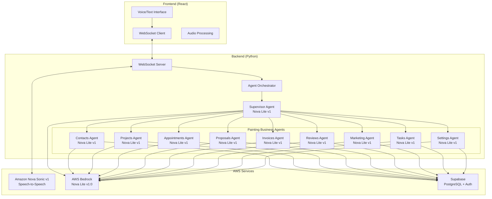

# Design Document

## Overview

The Voice-Based Painting Business Agent is a real-time voice assistant that enables painting contractors to manage their business operations through natural speech. The system implements a multi-agent architecture where an Agent Orchestrator manages the system lifecycle, and a Supervisor Agent routes queries to specialized painting business agents.

The system consists of three main layers:
1. **Frontend Layer**: React-based web interface with AWS Cloudscape components for voice and text interaction
2. **Backend Layer**: Python-based multi-agent system using the AWS Strands framework
3. **Data Layer**: Supabase PostgreSQL database

The system manages the complete lifecycle of a painting business including client contacts, painting projects with detailed specifications (paint type, brand, color, square footage), project proposals and estimates, invoices and billing, appointments for consultations and work, customer reviews, marketing campaigns, project tasks, and business goal tracking.

## Architecture

### High-Level Architecture



### Multi-Agent System Design

The system implements a hub-and-spoke architecture with clear separation of concerns:

1. **Agent Orchestrator**: System lifecycle manager and main entry point
2. **Supervisor Agent**: Intelligent query router with AI-powered decision making
3. **Painting Business Agents**: Domain-specific agents for different painting business operations (contacts, projects, appointments, proposals, invoices, reviews, marketing, tasks, settings)

### Communication Flow

The system supports two distinct input methods with different processing paths:

#### Voice Input Flow (via Nova Sonic)

1. User speaks → Frontend captures audio
2. Frontend streams audio via WebSocket → Backend receives audio
3. Audio forwarded to Nova Sonic bidirectional stream → Transcribed to text
4. WebSocket server passes text query to Agent Orchestrator
5. Orchestrator processes query → Supervisor Agent analyzes and routes
6. Specialized agent processes query → Database operations
7. Response text sent to Nova Sonic → Synthesized to audio
8. Audio streams back through WebSocket → Frontend plays audio

#### Text Input Flow (Direct to Agents)

1. User types message → Frontend captures text
2. Frontend sends text via WebSocket → Backend receives text
3. WebSocket server passes text query directly to Agent Orchestrator
4. Orchestrator processes query → Supervisor Agent analyzes and routes
5. Specialized agent processes query → Database operations
6. Response text flows back through WebSocket → Frontend displays as text

**Key Difference**: Text input bypasses Nova Sonic entirely and goes directly to the Agent Orchestrator, while voice input must pass through Nova Sonic for transcription and synthesis. Both paths share the same agent routing logic and maintain conversation context in the database.

## Components and Interfaces

### Frontend Components

#### VoiceAgent Component
- **Purpose**: Main React component managing voice and text interaction
- **Responsibilities**:
  - WebSocket connection management
  - Audio capture and playback
  - Chat message display
  - Configuration management
- **Key Methods**:
  - `handleSessionChange()`: Starts/stops voice sessions
  - `sendMessage()`: Sends messages via WebSocket

#### Audio Processing
- **AudioPlayer**: Manages audio playback
- **Resampling**: Converts audio to 16kHz

### Backend Components

#### WebSocket Server (`server.py`)
- **Purpose**: Manages real-time communication
- **Responsibilities**:
  - WebSocket connection management
  - Audio streaming
  - Nova Sonic integration

#### Agent Orchestrator (`orchestrator.py`)
- **Purpose**: Central coordinator
- **Responsibilities**:
  - Agent lifecycle management
  - Query processing coordination
  - Tool environment setup
  - System status monitoring

#### Supervisor Agent (`supervisor_agent.py`)
- **Purpose**: Intelligent routing
- **Routing Logic**:
  - Client contact/customer queries → Contacts_Agent
  - Painting project queries → Projects_Agent
  - Scheduling/appointment queries → Appointments_Agent
  - Proposal/estimate queries → Proposals_Agent
  - Invoice/billing queries → Invoices_Agent
  - Review/feedback queries → Reviews_Agent
  - Marketing/campaign queries → Marketing_Agent
  - Task/to-do queries → Tasks_Agent
  - Settings/goals queries → Settings_Agent

#### Painting Business Agents

**Contacts Agent**:
- **Database Access**: Contacts table
- **Capabilities**: CRUD operations on client contacts with relationship tracking to projects, invoices, appointments

**Projects Agent**:
- **Database Access**: Projects table
- **Capabilities**: Painting project management including specifications (paint type, brand, color, coats, primer), square footage, costs, timelines, completion tracking

**Appointments Agent**:
- **Database Access**: Appointments table
- **Capabilities**: Scheduling consultations and painting work, conflict detection, status management

**Proposals Agent**:
- **Database Access**: Proposals table
- **Capabilities**: Painting proposal/estimate creation, tracking, pricing calculations with sections and terms

**Invoices Agent**:
- **Database Access**: Invoices table
- **Capabilities**: Invoice generation for painting projects, payment tracking, line items, balance calculations

**Reviews Agent**:
- **Database Access**: Reviews table
- **Capabilities**: Customer review management for completed painting projects, response handling, analytics

**Marketing Agent**:
- **Database Access**: Campaigns table
- **Capabilities**: Marketing campaign management for painting services, performance tracking, ROI analysis

**Tasks Agent**:
- **Database Access**: Tasks table
- **Capabilities**: Task and to-do management for painting projects, checklist tracking, assignment management

**Settings Agent**:
- **Database Access**: Settings and goals tables
- **Capabilities**: Business goal tracking with progress calculations, system preferences

### Integration Interfaces

#### Supabase Database Integration
- **Database Operations**: CRUD operations on painting business tables
- **Relationship Management**: Tracking relationships between contacts, projects, invoices, etc.

#### Nova Sonic Integration

Nova Sonic provides a unified speech-to-speech model through a single bidirectional stream that handles both speech-to-text (ASR) and text-to-speech (TTS) simultaneously.

**Bidirectional Stream Architecture**:
- **Single Persistent Connection**: One `invoke_model_with_bidirectional_stream` connection handles both input and output
- **Full-Duplex Communication**: User can speak while system responds, enabling natural interruptions
- **Event-Based Protocol**: Structured events for audio/text input, audio/text output, content boundaries, and tool calls

**Speech-to-Text Flow**:
1. Frontend captures audio → sends as base64 via WebSocket
2. Backend queues audio chunks in `audio_input_queue`
3. `_process_audio_input()` task continuously sends `audioInput` events to Nova Sonic
4. Nova Sonic transcribes and returns `textOutput` events with transcribed text

**Text-to-Speech Flow**:
1. Agent generates text response
2. Backend sends `textInput` event to Nova Sonic via same stream
3. Nova Sonic synthesizes speech and streams back `audioOutput` events
4. `_process_responses()` task receives audio chunks and forwards to frontend
5. Frontend AudioPlayer plays audio smoothly in sequence

**Concurrent Processing**:
- Two async tasks run simultaneously on the bidirectional stream:
  - `_process_audio_input()`: Continuously sends queued audio to Nova Sonic
  - `_process_responses()`: Continuously receives and forwards responses from Nova Sonic
- This enables real-time conversation with natural turn-taking and interruptions

**Tool Integration**:
- Nova Sonic can emit `toolUse` events during conversation
- Backend detects tool calls and routes to Supervisor Agent
- Tool results sent back through stream as `toolResult` events
- Conversation continues seamlessly after tool execution

## Data Models

### Supabase Database Schema

The system uses Supabase PostgreSQL with the following existing tables in the `api` schema.

**Existing Tables in `api` schema:**
- `contacts` - Customer/client information
- `projects` - Painting projects with detailed specifications
- `invoices` - Invoice management with line items
- `proposals` - Business proposals with sections
- `appointments` - Scheduling and calendar management
- `reviews` - Customer reviews and feedback
- `campaigns` - Marketing campaign tracking
- `conversations` - Conversation history with messages JSONB field
- `tasks` - Task management linked to projects/clients
- `goals` - Business goal tracking with auto-calculated progress

**Missing Tables (need to be created):**
- `settings` - System configuration key-value store (Requirements 12.1-12.2)

**Foreign Key Relationships:**
- `contacts` ← `projects`, `invoices`, `proposals`, `appointments`, `reviews`, `conversations`, `tasks`
- `projects` ← `invoices`, `tasks`, `reviews`, `appointments`

### Voice Session Model
```python
class VoiceSession:
    session_id: str
    websocket_connection: WebSocket
    audio_stream: AudioStream
    conversation_state: ConversationState
    agent_context: Dict[str, Any]
    start_time: datetime
    last_activity: datetime
```

### Agent Message Model
```python
class AgentMessage:
    content_id: str
    role: Literal["USER", "ASSISTANT"]
    content: str
    content_type: Literal["TEXT", "AUDIO"]
    timestamp: datetime
    agent_name: Optional[str]
```

### Database Models (Actual Supabase Schema)

**Contacts Model** (api.contacts):
```python
class Contact:
    id: UUID
    name: str
    email: Optional[str]
    phone: Optional[str]
    company: Optional[str]
    address: Optional[str]
    city: Optional[str]
    state: Optional[str]
    zip_code: Optional[str]
    notes: Optional[str]
    tags: List[str]  # ARRAY type
    created_at: timestamptz
    updated_at: timestamptz
```

**Projects Model** (api.projects):
```python
class Project:
    id: UUID
    # user_id: UUID  # NEEDS TO BE ADDED for RLS
    project_number: Optional[str]  # unique
    name: str
    client_id: Optional[UUID]  # FK to contacts
    client_name: str
    status: str  # pending, in-progress, completed, cancelled, on-hold
    description: Optional[str]
    location: Optional[str]
    square_footage: Optional[Decimal]
    paint_type: Optional[str]
    surface_type: Optional[str]
    paint_brand: Optional[str]
    paint_color: Optional[str]
    number_of_coats: int  # default 1
    primer_needed: bool  # default false
    start_date: Optional[date]
    end_date: Optional[date]
    estimated_duration_days: Optional[int]
    actual_completion_date: Optional[date]
    estimated_cost: Optional[Decimal]
    actual_cost: Optional[Decimal]
    budget: Optional[Decimal]
    assigned_team: List[str]  # ARRAY type
    project_manager: Optional[str]
    completion_percentage: int  # 0-100, default 0
    notes: Optional[str]
    attachments: Dict  # JSONB, default []
    created_at: timestamptz
    updated_at: timestamptz
```

**Invoices Model** (api.invoices):
```python
class Invoice:
    id: UUID
    # user_id: UUID  # NEEDS TO BE ADDED for RLS
    invoice_number: str  # unique
    client_id: Optional[UUID]  # FK to contacts
    client_name: str
    client_email: Optional[str]
    project_id: Optional[UUID]  # FK to projects
    issue_date: date  # default CURRENT_DATE
    due_date: date
    paid_date: Optional[date]
    subtotal: Decimal  # default 0
    tax_rate: Decimal  # default 0
    tax_amount: Decimal  # default 0
    discount_amount: Decimal  # default 0
    total_amount: Decimal
    amount_paid: Decimal  # default 0
    balance_due: Decimal  # generated: total_amount - amount_paid
    line_items: List[Dict]  # JSONB, default []
    status: str  # draft, sent, viewed, partial, paid, overdue, cancelled
    notes: Optional[str]
    terms: Optional[str]
    payment_method: Optional[str]
    created_at: timestamptz
    updated_at: timestamptz
```

**Proposals Model** (api.proposals):
```python
class Proposal:
    id: UUID
    # user_id: UUID  # NEEDS TO BE ADDED for RLS
    proposal_number: str  # unique
    title: str
    client_id: Optional[UUID]  # FK to contacts
    client_name: str
    client_email: Optional[str]
    description: Optional[str]
    scope_of_work: Optional[str]
    subtotal: Decimal  # default 0
    tax_rate: Decimal  # default 0
    tax_amount: Decimal  # default 0
    discount_amount: Decimal  # default 0
    total_amount: Decimal
    sections: List[Dict]  # JSONB, default []
    issue_date: date  # default CURRENT_DATE
    valid_until: Optional[date]
    accepted_date: Optional[date]
    status: str  # draft, sent, viewed, accepted, rejected, expired
    notes: Optional[str]
    terms_and_conditions: Optional[str]
    created_at: timestamptz
    updated_at: timestamptz
```

**Appointments Model** (api.appointments):
```python
class Appointment:
    id: UUID
    # user_id: UUID  # NEEDS TO BE ADDED for RLS
    title: str
    client_id: Optional[UUID]  # FK to contacts
    client_name: str
    client_email: Optional[str]
    client_phone: Optional[str]
    project_id: Optional[UUID]  # FK to projects
    appointment_date: date
    start_time: time
    end_time: time
    duration_minutes: Optional[int]
    location: Optional[str]
    address: Optional[str]
    appointment_type: Optional[str]
    status: str  # scheduled, confirmed, in-progress, completed, cancelled, no-show, rescheduled
    assigned_to: Optional[str]
    description: Optional[str]
    notes: Optional[str]
    internal_notes: Optional[str]
    reminder_sent: bool  # default false
    reminder_sent_at: Optional[timestamptz]
    created_at: timestamptz
    updated_at: timestamptz
```

**Reviews Model** (api.reviews):
```python
class Review:
    id: UUID
    # user_id: UUID  # NEEDS TO BE ADDED for RLS
    client_id: Optional[UUID]  # FK to contacts
    client_name: str
    client_email: Optional[str]
    project_id: Optional[UUID]  # FK to projects
    rating: int  # 1-5
    title: Optional[str]
    review_text: Optional[str]
    platform: Optional[str]
    platform_url: Optional[str]
    status: str  # pending, approved, published, responded, flagged
    is_public: bool  # default true
    response_text: Optional[str]
    response_date: Optional[timestamptz]
    responded_by: Optional[str]
    review_date: date  # default CURRENT_DATE
    tags: List[str]  # ARRAY type
    sentiment: Optional[str]
    created_at: timestamptz
    updated_at: timestamptz
```

**Campaigns Model** (api.campaigns):
```python
class Campaign:
    id: UUID
    # user_id: UUID  # NEEDS TO BE ADDED for RLS
    name: str
    campaign_type: Optional[str]
    description: Optional[str]
    start_date: Optional[date]
    end_date: Optional[date]
    status: str  # draft, scheduled, active, paused, completed, cancelled
    budget: Optional[Decimal]
    actual_cost: Optional[Decimal]
    target_audience_count: int  # default 0
    sent_count: int  # default 0
    delivered_count: int  # default 0
    opened_count: int  # default 0
    clicked_count: int  # default 0
    converted_count: int  # default 0
    open_rate: Optional[Decimal]
    click_rate: Optional[Decimal]
    conversion_rate: Optional[Decimal]
    revenue_generated: Decimal  # default 0
    roi: Optional[Decimal]
    content: Dict  # JSONB, default {}
    tags: List[str]  # ARRAY type
    notes: Optional[str]
    created_at: timestamptz
    updated_at: timestamptz
```

**Conversations Model** (api.conversations):
```python
class Conversation:
    id: UUID
    # user_id: UUID  # NEEDS TO BE ADDED for RLS
    client_id: Optional[UUID]  # FK to contacts
    client_name: str
    subject: Optional[str]
    channel: Optional[str]
    status: str  # open, pending, resolved, closed
    priority: str  # low, normal, high, urgent
    assigned_to: Optional[str]
    messages: List[Dict]  # JSONB field for chat history, default []
    last_message_at: Optional[timestamptz]
    last_message_from: Optional[str]
    unread_count: int  # default 0
    tags: List[str]  # ARRAY type
    category: Optional[str]
    created_at: timestamptz
    updated_at: timestamptz
```

**Tasks Model** (api.tasks):
```python
class Task:
    id: UUID
    # user_id: UUID  # NEEDS TO BE ADDED for RLS
    title: str
    description: Optional[str]
    project_id: Optional[UUID]  # FK to projects
    client_id: Optional[UUID]  # FK to contacts
    status: str  # todo, in-progress, completed, cancelled
    priority: str  # low, medium, high, urgent
    assigned_to: Optional[str]
    due_date: Optional[date]
    completed_date: Optional[date]
    tags: List[str]  # ARRAY type
    checklist: List[Dict]  # JSONB, default []
    created_at: timestamptz
    updated_at: timestamptz
```

**Goals Model** (api.goals):
```python
class Goal:
    id: UUID
    # user_id: UUID  # NEEDS TO BE ADDED for RLS
    title: str
    description: Optional[str]
    goal_type: Optional[str]
    target_value: Decimal
    current_value: Decimal  # default 0
    unit: Optional[str]
    start_date: Optional[date]
    end_date: Optional[date]
    status: str  # active, completed, cancelled, overdue
    progress_percentage: int  # generated: LEAST(100, ROUND((current_value / target_value) * 100))
    created_at: timestamptz
    updated_at: timestamptz
```

**Settings Model** (api.settings - needs to be created):
```python
class Setting:
    id: UUID
    user_id: UUID  # FK to auth.users(id), for RLS filtering
    key: str  # Setting key (e.g., 'default_tax_rate', 'company_name')
    value: Dict  # JSONB - flexible value storage
    description: Optional[str]  # Human-readable description
    created_at: timestamptz
    updated_at: timestamptz
    # Unique constraint on (user_id, key) to prevent duplicate keys per user
```

**Note:** The `goals` table handles business goal tracking (Requirements 12.3-12.4), while `settings` handles system configuration (Requirements 12.1-12.2).

## Correctness Properties

*A property is a characteristic or behavior that should hold true across all valid executions of a system-essentially, a formal statement about what the system should do. Properties serve as the bridge between human-readable specifications and machine-verifiable correctness guarantees.*

### Session Management Properties

**Property 1: Session lifecycle consistency**
*For any* user interaction with session controls, starting a session should establish connections and audio capture, while ending a session should clean up all resources
**Validates: Requirements 1.1, 1.3**

**Property 2: Audio processing reliability**
*For any* valid audio input during an active session, the system should successfully process the audio and convert it to text
**Validates: Requirements 1.2**

**Property 3: Error recovery completeness**
*For any* connection error that occurs, the system should display an appropriate error message and offer restart options
**Validates: Requirements 1.4**

**Property 4: Session state visibility**
*For any* active voice session, the system should provide visual feedback indicating the current conversation state
**Validates: Requirements 1.5**

### Query Routing Properties

**Property 5: Contact query routing accuracy**
*For any* user query about contacts or customers, the Supervisor Agent should route the query to the Contacts_Agent
**Validates: Requirements 2.1**

**Property 6: Appointment query routing accuracy**
*For any* user query about scheduling or appointments, the Supervisor Agent should route the query to the Appointments_Agent
**Validates: Requirements 2.2**

**Property 7: Proposal query routing accuracy**
*For any* user query about proposals or deals, the Supervisor Agent should route the query to the Proposals_Agent
**Validates: Requirements 2.3**

**Property 8: Review query routing accuracy**
*For any* user query about reviews or feedback, the Supervisor Agent should route the query to the Reviews_Agent
**Validates: Requirements 2.4**

**Property 9: Marketing query routing accuracy**
*For any* user query about marketing or campaigns, the Supervisor Agent should route the query to the Marketing_Agent
**Validates: Requirements 2.5**

**Property 10: Settings query routing accuracy**
*For any* user query about settings or configuration, the Supervisor Agent should route the query to the Settings_Agent
**Validates: Requirements 2.6**

**Property 11: Query preservation through routing**
*For any* user query that gets routed, the original query should be passed unchanged to the selected specialized agent
**Validates: Requirements 2.7**

**Property 12: Response preservation through routing**
*For any* response from a specialized agent, the Supervisor Agent should return that response without modification
**Validates: Requirements 2.8**

### Voice Processing Properties

**Property 13: Text-to-speech conversion reliability**
*For any* text response generated by a specialized agent, the system should successfully convert it to speech
**Validates: Requirements 3.1**

**Property 14: Audio streaming continuity**
*For any* generated audio output, the system should stream the audio data to the user's speakers
**Validates: Requirements 3.2**

**Property 15: Audio interruption handling**
*For any* user interruption during audio playback, the system should immediately stop the current audio and process the new input
**Validates: Requirements 3.3**

**Property 16: Audio fallback reliability**
*For any* speech conversion failure, the system should display the text response as a fallback
**Validates: Requirements 3.4**

**Property 17: Audio chunk sequencing**
*For any* series of audio chunks received, the system should play them smoothly in sequence
**Validates: Requirements 3.5**

### Business Agent Properties

**Property 18: Contact information completeness**
*For any* valid contact query, the Contacts_Agent should retrieve and report complete contact details including name, email, phone, company, address, and notes
**Validates: Requirements 4.1**

**Property 19: Contact CRUD operation reliability**
*For any* valid contact creation or update request, the Contacts_Agent should modify the contacts table and confirm completion
**Validates: Requirements 4.2**

**Property 20: Contact relationship reporting**
*For any* contact with relationships, the Contacts_Agent should report all associated projects, appointments, proposals, reviews, and conversations
**Validates: Requirements 4.3**

**Property 21: Contact search functionality**
*For any* valid search criteria, the Contacts_Agent should support queries by name, company, email, phone, or tags
**Validates: Requirements 4.5**

**Property 22: Appointment information completeness**
*For any* valid appointment query, the Appointments_Agent should retrieve complete appointment details including date, time, location, client information, and status
**Validates: Requirements 5.1**

**Property 23: Appointment creation reliability**
*For any* valid appointment data, the Appointments_Agent should create appointments with all required fields including title, client, date, times, location, and type
**Validates: Requirements 5.2**

**Property 24: Appointment conflict detection**
*For any* scheduling conflict scenario, the Appointments_Agent should check existing appointments and suggest alternative times
**Validates: Requirements 5.3**

**Property 25: Appointment status management**
*For any* valid status change request, the Appointments_Agent should update appointment status appropriately
**Validates: Requirements 5.4**

**Property 26: Proposal information completeness**
*For any* valid proposal query, the Proposals_Agent should retrieve complete proposal details including title, client, description, scope, amounts, and status
**Validates: Requirements 6.1**

**Property 27: Proposal creation reliability**
*For any* valid proposal data, the Proposals_Agent should generate proposals with all required components including client information, sections, pricing, and terms
**Validates: Requirements 6.2**

**Property 28: Proposal calculation accuracy**
*For any* valid proposal data, the Proposals_Agent should accurately compute subtotal, tax amounts, discounts, and total amounts
**Validates: Requirements 6.4**

**Property 29: Review information completeness**
*For any* valid review query, the Reviews_Agent should retrieve complete review details including rating, title, review text, platform, and status
**Validates: Requirements 7.1**

**Property 30: Review response functionality**
*For any* valid review response request, the Reviews_Agent should create response text and update the response_date and responded_by fields
**Validates: Requirements 7.2**

**Property 31: Review analytics accuracy**
*For any* set of reviews, the Reviews_Agent should accurately calculate average ratings, sentiment analysis, and review trends
**Validates: Requirements 7.3**

**Property 32: Campaign information completeness**
*For any* valid campaign query, the Marketing_Agent should retrieve complete campaign details including name, type, status, dates, budget, and performance metrics
**Validates: Requirements 8.1**

**Property 33: Campaign performance reporting**
*For any* campaign with metrics, the Marketing_Agent should accurately report sent count, delivered count, open rate, click rate, conversion rate, and ROI
**Validates: Requirements 8.2**

**Property 34: Campaign analytics accuracy**
*For any* campaign with data, the Marketing_Agent should accurately calculate revenue generated, cost effectiveness, and provide optimization recommendations
**Validates: Requirements 8.5**

### Text Input Properties

**Property 35: Text message routing**
*For any* text message typed in the frontend interface, the system should send the text directly to the Supervisor_Agent
**Validates: Requirements 10.1**

**Property 36: Text query processing**
*For any* text input received, the Supervisor_Agent should process the text query and route it to the appropriate specialized agent
**Validates: Requirements 10.2**

**Property 37: Text response display**
*For any* text query processed, the system should display the response as text in the chat interface
**Validates: Requirements 10.3**

**Property 38: Input method consistency**
*For any* query type, the system should maintain the same routing and response logic for both voice and text input
**Validates: Requirements 10.5**

### Context Management Properties

**Property 39: Voice-to-text context preservation**
*For any* voice-to-text transition, the system should store messages in the conversations table and maintain context
**Validates: Requirements 11.1**

**Property 40: Text-to-voice context retrieval**
*For any* text-to-voice transition, the system should retrieve conversation history from the messages JSONB field
**Validates: Requirements 11.2**

**Property 41: Cross-session context maintenance**
*For any* agent query with history, the system should provide conversation history from the database to maintain context across sessions
**Validates: Requirements 11.4**

**Property 42: Client conversation linking**
*For any* client-related conversation, the system should associate conversation records with the appropriate client_id for relationship tracking
**Validates: Requirements 11.5**

### Settings and Configuration Properties

**Property 43: Settings retrieval functionality**
*For any* valid settings query, the Settings_Agent should retrieve configuration data from the api.settings table using key-value pairs
**Validates: Requirements 12.1**

**Property 44: Settings modification reliability**
*For any* valid configuration update, the Settings_Agent should modify the api.settings table and confirm configuration changes
**Validates: Requirements 12.2**

**Property 45: Goal tracking accuracy**
*For any* valid goal update, the Settings_Agent should update current_value and automatically calculate progress_percentage correctly
**Validates: Requirements 12.4**

## Error Handling

### Audio Processing Errors
- **Microphone Access Denied**: Fallback to text-only mode with user guidance
- **Nova Sonic Service Errors**: Retry logic with exponential backoff and text fallback
- **Audio Buffer Overflow**: Security limits with automatic cleanup
- **Codec Issues**: Format conversion with error recovery

### Database and Business Logic Errors
- **Connection Failures**: Retry mechanisms with user notification
- **Data Validation Errors**: Clear feedback with correction suggestions
- **Relationship Integrity Violations**: Automatic validation with rollback
- **Concurrent Modification**: Optimistic locking with conflict resolution

### System-Level Errors
- **WebSocket Disconnections**: Automatic reconnection with state preservation
- **Agent Failures**: Circuit breaker patterns with graceful degradation
- **Resource Exhaustion**: Load shedding with priority-based queuing
- **Configuration Errors**: Validation at startup with detailed diagnostics

## Testing Strategy

### Dual Testing Approach

The system requires both unit testing and property-based testing to ensure comprehensive coverage:

**Unit Tests**:
- Test individual agent functionality with mocked dependencies
- Validate database operations
- Cover UI interactions and state transitions

**Property-Based Tests**:
- Verify universal properties across all valid inputs
- Test system behavior with generated data
- Use **Hypothesis** (Python) for backend property testing and **fast-check** (JavaScript) for frontend property testing

### Property-Based Testing Configuration

- **Minimum Iterations**: Each property-based test must run at least 100 iterations
- **Test Tagging**: Each property-based test must include a comment with the format: `**Feature: voice-business-agent, Property {number}: {property_text}**`
- **Single Property Implementation**: Each correctness property must be implemented by exactly one property-based test

### Test Categories

**Business Agent Tests**:
- Unit tests for individual agent CRUD operations
- Property tests for query routing and response handling
- Integration tests for cross-agent data relationships
- Performance tests for concurrent sessions

**Voice and Text Processing Tests**:
- Unit tests for audio processing
- Property tests for conversation context management across input methods
- Integration tests for Nova Sonic communication
- Load tests for concurrent voice sessions

**Database Integration Tests**:
- Unit tests for Supabase operations
- Property tests for relationship integrity
- Performance tests for query optimization

### Test Environment Setup

**Backend Testing**:
- Mock Supabase services
- Test fixtures for painting business data
- Automated test data generation for property tests

**Frontend Testing**:
- Mock WebSocket connections
- Audio processing simulation
- Component testing with React Testing Library
- End-to-end testing with Cypress

**Integration Testing**:
- End-to-end voice and text interaction scenarios
- Cross-component communication validation
- Performance and reliability testing